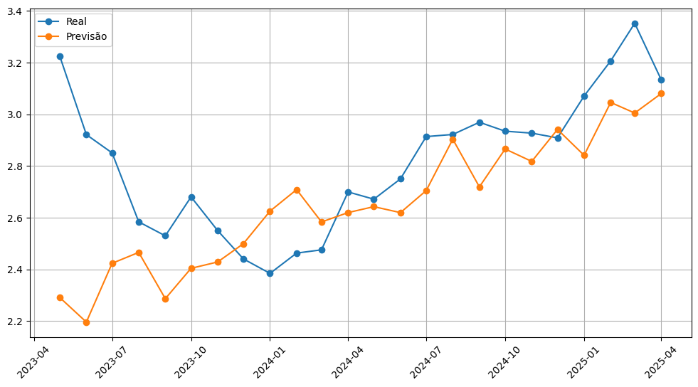

# Modelos Previsão do Etanol no Brasil

> **Resumo:** Aplicação de modelos Lineares e não-lineares para a previsão de série de preços do Etanol no estado de São Paulo/Brasil.

---

## O Desafio
O estado de São Paulo é um grande produtor de etanol, devido a alta volatilidade dos preços, a sazonalidade forte (safra e entressafra), influências do preço de petróleo, taxa de câmbio, preço do açúcar e políticas governamentais causam grandes impecilhos na previsibilidade.  

O objetivo deste projeto foi responder a uma pergunta central: **"É possível comparar modelos lineares e não lineares, e são capazes de capturar tanto padrões simples quanto dinâmicas complexas da série temporal, garantindo boa capacidade preditiva e generalização?."**

## Modelos utilizados
1. Modelos de Machine Learning:
- Ridge
- Lasso
- Linear Regression
- Random Forest
- LightGBM
- KNN
- MLP
2. Modelo LSTM - Deep Learning
3. Modelo SARIMA

## A Matéria-Prima (Coleta de Dados)
1. Para construir este modelo, criei um excel com os preços de etanol: base_de_dados_etanol.csv
* Fonte: CEPEA
* Período: 2015 a 2025
* Frequência: mensal
* Variável principal: preço do etanol (R$ e US$)
2. No código Machine_learning_models, gerei um excel: analise_desempenho.csv

## Métricas de Desempenho
Utilizei várias métricas:
MAE,
RMSE,
MAPE,
sMAPE.

## Desenvolvimento
Início → tratou a série temporal → aplicou diferentes modelos (lineares, ML e deep learning) → avaliou → comparou os resultados. Os resultados, foram:
- **Melhores modelos: Random Forest, LGBM, Ridge:**
* MAE ≈ R$ 0,40 – 0,50
* MAPE ≈ 14%
* RMSE ≈ R$ 0,52 - R$ 0,62
* sMAPE < 10
- **LSTM: boa performance, mas instável em alguns períodos**
* MAE ≈ R$ 0,14
* MAPE ≈ 5,31%
* RMSE ≈ R$ 0,16
* sMAPE ≈ 5%
- **SARIMA: pior desempenho geral**
* MAE ≈ R$ 0,49
* MAPE ≈ 55%
* RMSE ≈ R$ 0,18
* sMAPE ≈ 16%

## Resultados e Validação
O modelo final alcançou resultados expressivos indicam que o modelo LSTM apresentam melhor desempenho na previsão dos preços do etanol. A validação foi conduzida por meio de divisão treino-teste, validação cruzada temporal e múltiplas métricas de erro, garantindo robustez e confiabilidade aos resultados obtidos, que ajudaram a prever a **04/2023 a 04/2025**, foi uma ótima oportunidade para ver como o modelo estava se saindo em comparação a dados reais.

Abaixo, o gráfico demonstra como a linha da LSTM acompanha a realidade dos preços ao longo das décadas:

## Tecnologias Utilizadas
* **Python:** Linguagem principal
* **Pandas & NumPy:** Limpeza, formatação e Feature Engineering
* **Scikit-Learn:** Separação de dados e treinamento do Random Forest
* **Matplotlib & Seaborn:** Data Storytelling e visualização
* **statsmodels**: (SARIMA / SARIMAX) - Séries Temporais
* **Pytorch:** LSTM
* **OPTUNA:** Otimização de modelos
* **MLForecast:** Engenharia de atributos
---
*Projeto desenvolvido para estudo e aplicação do MBA em Data Science & Analytics para operações - POLI/USP.*
